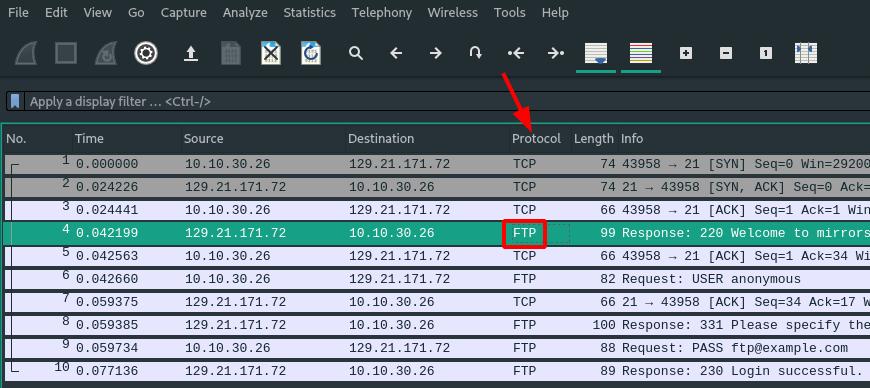

Tutorial : new parser
=====================

Create a new file in ``credslayer/parsers/`` named after the protocol you want to analyse. Usually you want to name your file the same as the `Protocol` column in wireshark.

But sometimes it won't work, so you might wanna check the name of the protocol by searching it using the following command line :

.. code-block:: none

    $ tshark -G protocols | grep -i SEARCH_HERE | awk '{print $NF}'

You now have to implement the following function that CredSLayer will automatically call for each incoming packet of your choosen protocol :

.. autofunction:: credslayer.parsers.ftp.analyse

Let's just take the ftp parser as an example, just read the comments :)

.. code-block:: python

    # coding: utf-8

    from pyshark.packet.layer import Layer

    from credslayer.core import logger
    from credslayer.core.session import Session

    # Remember this function is called for every single packet that belong to the protocol
    def analyse(session: Session, layer: Layer):

        # You can use the pretty_print method to show what's in the packet
        # layer.pretty_print()

        # Just an alias of credentials_being_built
        current_creds = session.credentials_being_built

        # We check (using pyshark's layer object) if the packet contains a "reponse_code" field.
        # This is the name tshark gave to the portion of the packet holding the response code.
        if hasattr(layer, "response_code"):
            code = int(layer.response_code)

            # Code 230 means authentication has been successful
            if code == 230 and current_creds.username:
                # That's how you log credentials you've just found
                logger.found(session, "credentials found: {} -- {}".format(current_creds.username, current_creds.password))

                # That's how you tell CredsLayer to remove the context and credentials currently being built.
                # You found everything you needed, you're done with everything you saved in the session.
                session.validate_credentials()

            # Code 430 means credentials were wrong
            elif code == 430:
                # That's also how you tell CredsLayer to remove the context and credentials currently being built.
                # You just found out credentials were wrong, you're not interested in what you saved in the session.
                session.invalidate_credentials_and_clear_session()

        # We check (using pyshark's layer object) if the packet contains a "request_command" field,
        # This is the name tshark gave to the portion of the packet holding the FTP command.
        elif hasattr(layer, "request_command"):
            command = layer.request_command

            # The username is sent next to the "USER" command.
            # We store the username in `current_creds`, which is the alias for the credentials being built in the session.
            if command == "USER":
                current_creds.username = layer.request_arg

            # Idem with the password
            elif command == "PASS":
                current_creds.password = layer.request_arg

I really encourage you to read about :ref:`Sessions` as this is what enables you to build a persistent context across each call to your *analyse* function.
For example in FTP, the username is first sent in a packet, then the password in another one. Thanks to the :ref:`Sessions` object, you will be able to keep track
of some valuable data. Then somehow (depending on the protocol you are analysing) you might receive an indicator of success or failure, in FTP codes 230 and 430 fulfill that purpose.
When you find such an indicator, you must call ``session.invalidate_credentials_and_clear_session`` or ``session.validate_credentials`` to tell CredSLayer you're done with those credentials.