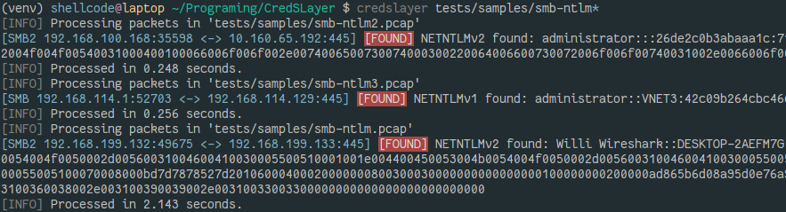

Welcome to CredSLayer's documentation!
======================================

CredSLayer goal is to look for credentials and other useful stuff in network captures. Two modes are available, pcap scanning and active processing. The latest listens for packets on a chosen interface and extract on the fly valuable data.

Have you heard about Pcredz or net-creds ? Well this tool pushes the boundaries even further by using Wireshark dissectors, it's therefore more accurate and reliable.

This tool is really helpful if you're doing IT security or if you want to scan your own network to see if anything critical is transmitted.

.. toctree::
    :hidden:
    :caption: Getting Started
    :maxdepth: 4

    getting-started/installation
    getting-started/usage-cli
    getting-started/usage-own-project
    getting-started/limitations

.. toctree::
    :hidden:
    :caption: Contribute
    :maxdepth: 4

    contribute/setup
    contribute/code-explanations
    contribute/create-parser
